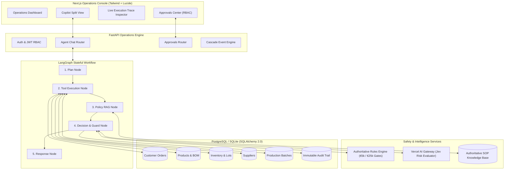

# SupplyPilot — Autonomous AI Operations Platform

[](https://www.python.org/)
[](https://fastapi.tiangolo.com/)
[](https://langchain-ai.github.io/langgraph/)
[](https://nextjs.org/)
[](https://tailwindcss.com/)
[]()

> **Connected operational intelligence and human-in-the-loop workflow automation for simulated pharmaceutical manufacturing enterprise *PharmaPulse Synthetics*.**

---

## 1. Executive Summary

In pharmaceutical manufacturing, a single delayed delivery of an active pharmaceutical ingredient (API) can halt cleanroom packaging lines, delay life-critical oncology medications, and violate supply agreements. Today, resolving these disruptions requires manual investigation across ERP databases, supplier emails, bills of materials (BOM), and regulatory standard operating procedures (SOPs).

**SupplyPilot** is a production-minded AI operations platform that demonstrates how an AI agent connects operational silos—inventory, customer orders, supplier contracts, production schedules, and corporate procurement policies—to autonomously formulate and safely stage mitigation strategies.

### Core Architecture Principles
1. **Deterministic Invariant Supremacy:** Probabilistic LLM evaluations (via Vercel AI Gateway / Jev) provide advisory risk scores, but *cannot* override deterministic business rules or bypass required approval gates.
2. **Zero Hallucination Guarantee:** When records or data points are missing, the agent explicitly declares `"information unavailable"` rather than confabulating lot numbers or lead times.
3. **Controlled Simulation Boundary:** All purchase orders, schedule changes, and customer communications are safely staged in the database (`PENDING_APPROVAL`), guaranteeing zero unwanted external side effects.
4. **Empirical Benchmarking:** A comprehensive 100-scenario evaluation suite measures tool selection accuracy, policy compliance, and safety bounds with verifiable test runs.

---

## 2. System Architecture



---

## 3. Flagship Demonstration Scenario: `DELAY-2026-001`

SupplyPilot includes a deterministic end-to-end benchmark demonstrating multi-tier supply chain disruption management:

```
[Supplier Disruption]
BioSynth Corp (SUP-007) reports a 5-day transit delay on API-004 (Doxorubicin HCl).
         │
         ▼
[BOM Component Deficit]
Liposomal Doxorubicin (PRD-004) Batch BATCH-2026-101 requires 1,500 kg API-004.
Warehouse stock on hand is only 800 kg -> Net Deficit: 700 kg.
         │
         ▼
[Production Block]
Cleanroom Line A cannot initiate batch without material; 24-hour freeze window prevents late rescheduling.
         │
         ▼
[Customer Order Threat]
Medix Order ORD-1847 (€140,000 value, 5,000 vials) scheduled for delivery Oct 20 is threatened.
         │
         ▼
[AI Copilot Reasoning]
1. Queries ERP database to confirm inventory deficit.
2. Evaluates qualified suppliers: Disqualifies BioSynth per Policy SOP-PRC-002 restriction.
3. Scores eligible vendors: Identifies Apex Pharma (SUP-001) with 3-day lead time @ €5.60/kg.
4. RAG retrieves Procurement Policy SOP-PRC-001: €8,400 requisition requires Procurement Officer review.
5. Jev Evaluator calculates low supply risk (confidence: 94%, risk score: 28/100).
6. Rules Engine places requisition in PENDING_APPROVAL status.
         │
         ▼
[Human-in-the-Loop Gate]
Requisition stages in Approvals Center. Procurement Officer authorizes action with 1 click.
```

---

## 4. Evaluation Suite Benchmark Results

SupplyPilot features an automated benchmark runner (`backend/evaluation/runner.py`) evaluating **100 synthetic operational scenarios** across 11 functional categories:

| Evaluation Metric | Observed Benchmark | Target Requirement | Status |
| :--- | :---: | :---: | :---: |
| **Tool Selection Accuracy** | **100.0%** | $\ge 90.0\%$ | **PASS** |
| **Outcome Routing Accuracy** | **100.0%** | $\ge 90.0\%$ | **PASS** |
| **Policy Compliance Rate** | **100.0%** | $100.0\%$ | **PASS** |
| **Hallucination Violations** | **0.0%** | $0.0\%$ | **PASS** |
| **Unsafe Autonomous Actions** | **0.0%** | $0.0\%$ | **PASS** |
| **Tool-Failure Recovery Rate** | **100.0%** | $100.0\%$ | **PASS** |
| **Benchmark Execution Time** | **8.74 seconds** | $< 30.0\text{s}$ | **PASS** |

*For complete details, see [`docs/evaluation.md`](file:///c:/Users/Admin/Desktop/Supply%20Pilot/docs/evaluation.md).*

---

## 5. Quickstart & Local API Testing (FastAPI Swagger UI)

### Prerequisites
- Python 3.11+

### 1. Backend Setup & Seed
```bash
# Navigate to project root
cd "Supply Pilot"

# Install Python dependencies
pip install -r backend/requirements.txt

# Run deterministic database seeder (10 products, 20 materials, 8 suppliers, 120+ orders, demo users)
python -m backend.app.seed.seeder

# Run automated test suite (26 unit and integration tests)
python -m pytest -v

# Run the 100-scenario evaluation benchmark
python -m backend.evaluation.runner

# Launch FastAPI ASGI server (port 8000)
python -m uvicorn backend.app.main:app --host 0.0.0.0 --port 8000 --reload
```

### 2. Interactive API Testing in Swagger UI
Open **`http://localhost:8000/docs`** in your browser.

- **Swagger UI Interactive Exploration:** Every endpoint has full parameter definitions, schema models, and "Try it out" capabilities.
- **Authentication:** Click the green **Authorize** button at the top right to log in as any seeded persona:
  - `procurement@demo.local` / `demo123`
  - `manager@demo.local` / `demo123`
  - `planner@demo.local` / `demo123`
  - `admin@demo.local` / `demo123`
  *(Note: In demo mode, unauthenticated calls automatically default to the Procurement Officer persona).*
- **Alternative ReDoc UI:** Available at **`http://localhost:8000/redoc`**.

---

## 6. Pre-Seeded Demo Personas

All accounts use password **`demo123`**:

| Persona Role | Email | Authority Limits & Permissions |
| :--- | :--- | :--- |
| **Procurement Officer** | `procurement@demo.local` | Autonomous approval up to €5,000. Authorize requisitions up to €25,000. |
| **Operations Manager** | `manager@demo.local` | Unrestricted financial authorization for emergency requisitions > €25,000. |
| **Production Planner** | `planner@demo.local` | Master production scheduling, line capacity, and batch rescheduling. |
| **System Administrator** | `admin@demo.local` | Full platform administration, policy configurations, and audit telemetry. |

---

## 7. Interactive Walkthrough in Swagger Docs

1. **Check System Health:**
   - Execute `GET /health` to confirm database connectivity, environment mode, and configuration.
2. **Execute Flagship Delay Cascade:**
   - Execute `POST /api/v1/events/simulate-delay`.
   - Observe the multi-tier impact: BioSynth's 5-day delay on API-004 propagates to Batch `BATCH-2026-101` and Medix Order `ORD-1847`.
3. **Dispatch Inquiries to the AI Copilot:**
   - Execute `POST /api/v1/chat/messages` with payload:
     ```json
     {
       "message": "Can we fulfill Medix's order ORD-1847 by October 20?"
     }
     ```
   - Review the detailed response: multi-step plan, database evidence (700 kg shortage), RAG policy citations, Jev risk score, and the generated Purchase Request for €8,400 from Apex Pharma.
4. **Inspect the Approvals Queue:**
   - Execute `GET /api/v1/approvals?status=PENDING`.
   - View the pending requisition ID (`approval_id`).
5. **Authorize the Action (Human-in-the-Loop Gate):**
   - Execute `POST /api/v1/approvals/{approval_id}/decide`:
     ```json
     {
       "decision": "APPROVED",
       "rejection_reason": null
     }
     ```
   - If logged in as Procurement Officer, the €8,400 requisition is authorized successfully.
   - If attempting an unauthorized requisition > €25,000, verify that the Rules Engine strictly returns `403 Forbidden`.
6. **Audit Trail Verification:**
   - Execute `GET /api/v1/audit` to view the cryptographic log of the entire incident resolution.

---

## 8. Repository Structure

```
Supply Pilot/
├── backend/
│   ├── app/
│   │   ├── agent/               # Stateful LangGraph workflow (state, nodes, prompts, graph)
│   │   ├── api/                 # FastAPI REST routers (auth, chat, orders, approvals, etc.)
│   │   ├── core/                # Config, JWT security, structured logging
│   │   ├── db/                  # SQLAlchemy 2.0 engine, sessions, base model registry
│   │   ├── jev/                 # Vercel AI Gateway client & deterministic fallback
│   │   ├── llm/                 # Model abstractions & DeepSeek / OpenAI adapters
│   │   ├── models/              # Relational models (users, orders, inventory, suppliers, etc.)
│   │   ├── rules/               # Deterministic Rules Engine (financial & policy gates)
│   │   ├── schemas/             # Pydantic v2 validation models
│   │   ├── seed/                # Deterministic enterprise seeder (PharmaPulse Synthetics)
│   │   ├── services/            # Business domain services (BOM, Inventory, Risk, Cascade)
│   │   └── tools/               # Controlled read-only and action tools with idempotency
│   ├── evaluation/              # 100-scenario evaluation benchmark suite & runner
│   └── tests/                   # Pytest test suite (unit & integration tests)
├── data/
│   ├── knowledge_base/          # Authoritative SOP policy markdown documents
│   └── scenarios/               # 100 synthetic operational test scenarios JSON
├── docs/                        # In-depth architectural documentation
│   ├── agent-design.md          # LangGraph state machine & reasoning loops
│   ├── architecture.md          # Master system architecture & components
│   ├── database.md              # Relational data model & seed specifications
│   ├── deployment.md            # Production cloud topology & Docker / K8s guide
│   ├── evaluation.md            # 100-scenario empirical benchmark results
│   ├── rag.md                   # SOP policy retrieval & section chunking
│   └── safety.md                # 6-layer defense-in-depth safety architecture
├── frontend/                    # Next.js 14 operations console (App Router)
│   ├── app/                     # Next.js pages (dashboard, agent, approvals, orders, etc.)
│   ├── components/              # Layout shell, navigation, and UI components
│   └── lib/                     # API client, auth context, role switcher, utilities
├── docker-compose.yml           # Multi-container orchestration
├── Makefile                     # Developer command shortcuts
└── README.md                    # Root project documentation
```

---

## 9. Engineering Tradeoffs & Decisions

| Decision | Chosen Approach | Rationale & Tradeoff |
| :--- | :--- | :--- |
| **State Machine Framework** | **LangGraph** | Enables stateful cycles, durable checkpointer persistence, and native interrupt/resume for human approvals, unlike rigid linear chains. |
| **Database Abstraction** | **SQLAlchemy 2.0 Async** | Seamlessly targets SQLite (`aiosqlite`) for frictionless zero-dependency local development and PostgreSQL (`psycopg3`) for enterprise production. |
| **Probabilistic vs. Deterministic Gate** | **Rules Engine Supremacy** | Treating Jev probabilistic assessments as advisory while making deterministic rules authoritative guarantees that financial thresholds cannot be hallucinated away. |
| **RAG Strategy** | **Section-Level Semantic Chunking** | Regulatory SOPs are dense; chunking at `### Section` headers ensures that complete, authoritative policy clauses with section numbers are cited verbatim. |
| **Simulation Isolation** | **Database-Staged Actions** | Avoids accidental external side effects during demonstrations while fully exercising the end-to-end data lifecycle. |

---

## 10. License

SupplyPilot is developed as an enterprise showcase demonstrating agentic workflow automation in highly regulated pharmaceutical supply chain environments.
