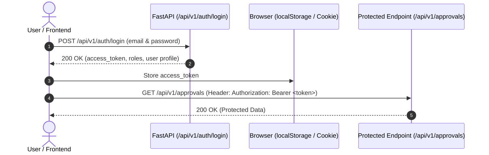

# SupplyPilot — Frontend Developer & Integration Guide

Welcome to **SupplyPilot**! This document provides frontend engineers with everything needed to build a responsive user interface on top of the SupplyPilot FastAPI backend.

---

## 1. Domain Overview & Platform Architecture

### 1.1 What is SupplyPilot?
SupplyPilot is an **AI-powered operations platform** designed for *PharmaPulse Synthetics*, a simulated enterprise manufacturer of sterile injectables and oral solid pharmaceuticals.

In pharmaceutical manufacturing:
- **Raw Materials (APIs):** Active Pharmaceutical Ingredients are sourced from qualified suppliers (e.g., API-004 Doxorubicin HCl).
- **Bills of Materials (BOM):** Each finished product (e.g. Liposomal Doxorubicin, PRD-004) requires exact ratios of active APIs, excipients, and aseptic packaging. Production runs in standard multi-thousand-vial batch sizes.
- **Strict Compliance (SOPs):** Procurement, vendor selection, batch scheduling, and customer notifications are strictly governed by corporate operating procedures.

### 1.2 The Core Backend Philosophy: Deterministic Supremacy
SupplyPilot pairs an LLM (LangGraph agent) with a **Deterministic Rules Engine** and **Jev Probabilistic Decision Support**:
1. **The LLM is an Orchestrator:** It queries databases, calculates material shortages, and plans steps.
2. **Deterministic Rules are Inviolable:** Financial thresholds (€5k auto, €5k–€25k Procurement Officer, >€25k Operations Manager) execute outside the LLM context. No prompt can bypass an approval gate.
3. **Jev AI Gateway is Advisory:** Jev provides probabilistic risk scores (0–100) and confidence ratings. It may escalate an action to human review, but cannot downgrade a hard rule.
4. **Zero-Hallucination Invariant:** Missing records return `"information unavailable"` instead of confabulated data.
5. **Simulation Boundary:** All purchase requests and schedule changes are staged in the database (`PENDING_APPROVAL`). No external side effects occur without human sign-off.

---

## 2. API Server & Authentication Architecture

### 2.1 Base URLs
- **API Base URL:** `http://localhost:8000/api/v1`
- **Swagger Documentation:** `http://localhost:8000/docs`
- **ReDoc Documentation:** `http://localhost:8000/redoc`

*Note: All endpoints are accessible both with `/api/v1` (e.g. `/api/v1/orders`) and without (e.g. `/orders`). Use `/api/v1/...` for standard frontend clients.*

### 2.2 Authentication & JWT Token Flow
SupplyPilot uses OAuth2 Bearer Tokens (JWT) signed with HMAC-SHA256.



#### Demo Mode Fallback:
In local development, if no `Authorization` header is passed, the backend automatically defaults to the **Procurement Officer** persona (`procurement@demo.local`). This allows frontend developers to test read and write flows without logging in first.

### 2.3 Pre-Seeded Personas (Password: `demo123`)

| Persona Role | Email | Financial Thresholds & Permissions |
| :--- | :--- | :--- |
| **`procurement_officer`** | `procurement@demo.local` | Autonomous approval up to €5,000. Authorize requisitions up to €25,000. |
| **`operations_manager`** | `manager@demo.local` | Unrestricted financial authorization for emergency requisitions > €25,000. |
| **`production_planner`** | `planner@demo.local` | Master production scheduling, line capacity, and batch rescheduling. |
| **`admin`** | `admin@demo.local` | Full platform administration, policy configurations, and audit telemetry. |

---

## 3. Comprehensive Endpoint Reference

### 3.1 Authentication

#### `POST /api/v1/auth/login`
Authenticates a user. Accepts both JSON payload and Form Data (`application/x-www-form-urlencoded`).

**Request (JSON):**
```json
{
  "email": "procurement@demo.local",
  "password": "demo123"
}
```

**Response (`200 OK`):**
```json
{
  "access_token": "eyJhbGciOiJIUzI1NiIsInR5cCI6IkpXVCJ9...",
  "token_type": "bearer",
  "user_id": "usr-001",
  "email": "procurement@demo.local",
  "full_name": "Sarah Chen",
  "department": "Procurement & Sourcing",
  "roles": ["procurement_officer"]
}
```

#### `GET /api/v1/auth/me`
Returns the currently authenticated user profile based on the JWT Bearer token.

---

### 3.2 Executive Dashboard

#### `GET /api/v1/dashboard/summary`
Returns top-level KPIs, open order statistics, catalog counts, and orders currently at risk.

**Response (`200 OK`):**
```json
{
  "total_orders": 124,
  "open_orders": 118,
  "raw_materials_count": 20,
  "products_count": 10,
  "suppliers_count": 8,
  "active_batches_count": 4,
  "at_risk_orders_count": 1,
  "pending_approvals_count": 1,
  "at_risk_orders": [
    {
      "order_number": "ORD-1847",
      "customer_name": "Medix Hospital Solutions",
      "delivery_deadline": "2026-10-20T00:00:00Z",
      "total_amount": 140000.00,
      "risk_level": "HIGH",
      "risk_score": 72,
      "primary_risk_driver": "Raw Material Deficit (API-004)"
    }
  ]
}
```

---

### 3.3 Customer Orders

#### `GET /api/v1/orders`
Retrieves a paginated list of customer orders with calculated risk levels.
- **Query Parameters:**
  - `status` *(optional)*: `"CONFIRMED"`, `"PROCESSING"`, `"PENDING"`, `"SHIPPED"`, `"CANCELLED"`
  - `limit` *(optional, default 50)*: Number of records
  - `offset` *(optional, default 0)*: Pagination offset

**Response (`200 OK`):** Array of order objects with `order_number`, `customer_name`, `delivery_deadline`, `total_amount`, `status`, and items.

#### `GET /api/v1/orders/{order_id}`
Returns complete details for a single order (e.g. `ORD-1847`):
- Customer metadata
- Ordered product line items (SKU, product name, quantity, unit price, subtotal)
- Inventory commitments and reservations

#### `GET /api/v1/orders/{order_id}/risk`
Returns the deterministic risk assessment for the specified order:
```json
{
  "order_number": "ORD-1847",
  "composite_risk_score": 72,
  "risk_level": "HIGH",
  "inventory_risk": 80,
  "supplier_risk": 65,
  "production_risk": 70,
  "primary_risk_driver": "Raw Material Deficit (API-004)"
}
```

---

### 3.4 Warehouse Inventory

#### `GET /api/v1/inventory`
Returns real-time stock positions, warehouse locations, and safety stock thresholds.
- **Query Parameters:**
  - `type` *(optional)*: `"raw_materials"` or `"finished_goods"`

**Raw Materials Item Schema:**
```json
{
  "id": "mat-004",
  "material_code": "API-004",
  "material_name": "Doxorubicin Hydrochloride Sterile API",
  "grade": "USP / EP Sterile Grade",
  "unit": "kg",
  "quantity_on_hand": 800.0,
  "reserved_quantity": 800.0,
  "available_quantity": 0.0,
  "safety_stock": 500.0,
  "reorder_point": 1000.0,
  "warehouse_location": "Vault-C4"
}
```

**Finished Goods Item Schema:**
```json
{
  "id": "prd-004",
  "product_sku": "PRD-004",
  "product_name": "Liposomal Doxorubicin 2 mg/mL",
  "dosage_form": "Injectable Suspension",
  "strength": "2 mg/mL (20 mg vial)",
  "quantity_on_hand": 1200,
  "committed_quantity": 1200,
  "available_quantity": 0,
  "standard_batch_size": 5000,
  "reorder_point": 2500
}
```

---

### 3.5 Supplier Scorecards & Compliance

#### `GET /api/v1/suppliers`
Returns all qualified vendors with reliability metrics, lead times, and policy qualification tags.

**Response (`200 OK`):**
```json
[
  {
    "id": "sup-001",
    "supplier_code": "SUP-001",
    "supplier_name": "Apex Pharma Synthetics",
    "country": "Germany",
    "reliability_rating": 0.96,
    "lead_time_days": 3,
    "is_active": true,
    "catalog": [
      {
        "material_code": "API-004",
        "unit_price": 5.60,
        "is_primary": true
      }
    ]
  },
  {
    "id": "sup-007",
    "supplier_code": "SUP-007",
    "supplier_name": "BioSynth Corp",
    "country": "Switzerland",
    "reliability_rating": 0.82,
    "lead_time_days": 7,
    "is_active": true,
    "catalog": [
      {
        "material_code": "API-004",
        "unit_price": 5.20,
        "is_primary": false
      }
    ]
  }
]
```

---

### 3.6 Master Production Schedule (MPS)

#### `GET /api/v1/production/batches`
Returns planned, running, and stalled manufacturing batches across Cleanroom Lines A & B.
- **Query Parameters:** `status` *(optional)*: `"SCHEDULED"`, `"RUNNING"`, `"STALLED_SHORTAGE"`, `"COMPLETED"`

**Batch Item Schema:**
```json
{
  "id": "batch-101",
  "batch_number": "BATCH-2026-101",
  "product_sku": "PRD-004",
  "planned_quantity": 5000,
  "production_line": "Cleanroom Line A",
  "scheduled_start_date": "2026-10-12T08:00:00Z",
  "scheduled_end_date": "2026-10-15T18:00:00Z",
  "status": "SCHEDULED"
}
```

#### `GET /api/v1/production/capacity`
Returns cleanroom line utilization rates and freeze-window status.

---

### 3.7 Human-in-the-Loop Approvals Center

#### `GET /api/v1/approvals`
Lists all queued action proposals requiring human review.
- **Query Parameters:**
  - `status` *(optional)*: `"PENDING"`, `"APPROVED"`, `"REJECTED"`

**Approval Item Schema:**
```json
{
  "id": "appr-8472-a1",
  "action_type": "PURCHASE_REQUEST",
  "monetary_value": 8400.00,
  "required_role": "procurement_officer",
  "status": "PENDING",
  "reason": "Mitigate raw material shortage for scheduled order fulfillment. Dual-sourcing switch to Apex Pharma.",
  "order_id": "ORD-1847",
  "agent_run_id": "run-f19b-4882",
  "created_at": "2026-10-01T15:20:00Z"
}
```

#### `POST /api/v1/approvals/{approval_id}/decide`
Authorizes or rejects an action proposal. **Strictly enforces user role permissions.**

**Request:**
```json
{
  "decision": "APPROVED",
  "rejection_reason": null
}
```
*(If `decision` is `"REJECTED"`, provide `"rejection_reason": "Price exceeds budget"`).*

**Error Response (`403 Forbidden`):**
If a Procurement Officer attempts to authorize a requisition exceeding €25,000:
```json
{
  "detail": "Operation requires one of roles: operations_manager. Caller has: procurement_officer"
}
```

---

### 3.8 AI Operations Copilot (LangGraph Stateful Agent)

#### `POST /api/v1/chat/messages`
The flagship agent reasoning endpoint. Submits a user prompt, executes controlled database tools, searches authoritative SOP policies, evaluates Jev risk, applies Rules Engine gates, and returns a rich trace payload.

**Request:**
```json
{
  "message": "Can we fulfill Medix's order ORD-1847 by October 20?",
  "thread_id": "optional-uuid-string"
}
```

**Response (`200 OK`):**
```json
{
  "run_id": "run-f19b-4882-9a01",
  "thread_id": "thread-001",
  "response": "Medix's order ORD-1847 requires 5,000 vials of PRD-004. Current inventory is committed. A BOM deficit of 700 kg was detected on API-004. Primary vendor BioSynth is delayed (+5 days). I have formulated a dual-sourcing purchase requisition for 1,500 kg from Apex Pharma Synthetics at €5.60/kg (€8,400.00). Per Policy SOP-PRC-001 Section 2.1, this requisition requires Procurement Officer authorization.",
  "plan": [
    "Retrieve order and delivery deadline",
    "Check finished-product inventory and commitments",
    "Evaluate production capacity and line schedule",
    "Calculate raw material component shortages (BOM)",
    "Discover eligible qualified suppliers",
    "Retrieve corporate procurement approval policy",
    "Evaluate action risk and required authorization",
    "Prepare procurement recommendation and approval request"
  ],
  "retrieved_evidence": {
    "order": {
      "order_number": "ORD-1847",
      "customer_name": "Medix Hospital Solutions",
      "delivery_deadline": "2026-10-20"
    },
    "finished_inventory": {
      "available_quantity": 0
    },
    "material_shortage": {
      "has_shortage": true,
      "primary_shortage_material": "API-004",
      "materials": [
        {
          "material_code": "API-004",
          "required_quantity": 1500.0,
          "available_quantity": 800.0,
          "shortage_quantity": 700.0
        }
      ]
    },
    "supplier_recommendation": {
      "recommended_supplier": {
        "supplier_code": "SUP-001",
        "supplier_name": "Apex Pharma Synthetics",
        "lead_time_days": 3,
        "unit_price": 5.60,
        "total_cost": 8400.00,
        "recommendation_reason": "Fastest compliant lead time (3 days) meeting deadline."
      }
    }
  },
  "policy_citations": [
    {
      "policy_id": "SOP-PRC-001",
      "document": "purchase_approval_policy.md",
      "section_title": "Section 2.1 Financial Approval Thresholds",
      "snippet": "Tier 2: Single Procurement Officer sign-off required for requisitions between €5,000 and €25,000."
    },
    {
      "policy_id": "SOP-PRC-002",
      "document": "supplier_selection_policy.md",
      "section_title": "Section 3.2 Dual-Sourcing Protocol",
      "snippet": "When a primary supplier experiences a delay exceeding 48 hours, secondary qualified suppliers shall receive priority allocation."
    }
  ],
  "proposed_action": {
    "action_type": "PURCHASE_REQUEST",
    "monetary_value": 8400.00,
    "status": "PENDING_APPROVAL",
    "approval_id": "appr-8472-a1"
  },
  "jev_evaluation": {
    "confidence_score": 0.94,
    "recommended_decision": "APPROVE",
    "risk_score": 28,
    "decision_justification": "Evidence is sufficient. Apex Pharma is GMP certified with 96% on-time SLA. Delivery risk is mitigated."
  },
  "rule_evaluation": {
    "is_compliant": true,
    "requires_human_approval": true,
    "required_approval_role": "procurement_officer",
    "status": "PENDING_APPROVAL"
  },
  "approval_required": true,
  "approval_id": "appr-8472-a1",
  "status": "PENDING_HUMAN_APPROVAL"
}
```

---

### 3.9 Disruption Simulation & Cascade Engine

#### `POST /api/v1/events/simulate-delay` (Alias: `/api/v1/events/flagship-scenario`)
Triggers the deterministic flagship 5-day delay cascade on `DELAY-2026-001`.

**Response (`200 OK`):**
```json
{
  "delay_code": "DELAY-2026-001",
  "delayed_material": "API-004",
  "supplier_name": "BioSynth Corp",
  "delay_days": 5,
  "affected_batches": ["BATCH-2026-101"],
  "affected_orders": [
    {
      "order_number": "ORD-1847",
      "customer_name": "Medix Hospital Solutions",
      "delivery_deadline": "2026-10-20"
    }
  ],
  "mitigation_options": [
    {
      "supplier_code": "SUP-001",
      "supplier_name": "Apex Pharma Synthetics",
      "estimated_cost": 8400.00,
      "lead_time_days": 3
    }
  ]
}
```

#### `GET /api/v1/events`
Lists all logged disruption events and active supply chain anomalies.

---

### 3.10 Agent Execution Traces & Runs

#### `GET /api/v1/runs`
Lists historical agent execution sessions.
- Schema includes `id`, `goal`, `user_role`, `status`, `created_at`.

#### `GET /api/v1/runs/{run_id}`
Returns the comprehensive execution telemetry:
- Step-by-step timeline (`steps`: step number, description, duration in milliseconds, status)
- Actions proposed
- Approvals linked to the run

---

### 3.11 Immutable Audit Trail

#### `GET /api/v1/audit`
Returns the cryptographically aligned, timestamped audit log of all operations.
- **Query Parameters:** `limit` *(default 100)*

**Audit Event Schema:**
```json
{
  "id": "aud-9912",
  "timestamp": "2026-10-01T15:20:00Z",
  "action": "ACTION_PROPOSED",
  "user_email": "procurement@demo.local",
  "entity_type": "PurchaseRequest",
  "entity_id": "appr-8472-a1",
  "details": {
    "monetary_value": 8400.0,
    "supplier": "SUP-001",
    "material": "API-004"
  }
}
```

---

## 4. The Flagship Demonstration Narrative

When designing the UI, the centerpiece demonstration follows this exact narrative:

```
Step 1: User or Operator triggers Flagship Delay
        POST /api/v1/events/simulate-delay
        BioSynth (SUP-007) delays API-004 shipment by 5 days.

Step 2: Disruption Cascade Visualizer
        Show a 4-step horizontal or vertical pipeline:
        [1. Supplier Delay] ──> [2. 700 kg Shortage] ──> [3. Batch BATCH-101 Stalled] ──> [4. Medix ORD-1847 Threatened]

Step 3: User launches Copilot Inquiry
        Prompt: "Can we fulfill Medix's order ORD-1847 by October 20?"
        Agent analyzes inventory, explodes BOM, disqualifies BioSynth (SOP-PRC-002), 
        and proposes Apex Pharma (€8,400.00, 3-day delivery).

Step 4: Live Execution Trace Panel
        Right-side drawer/panel rendering:
        - Plan: 8 steps executed
        - Evidence: 700 kg shortage, Apex Pharma quote
        - Policy Citations: SOP-PRC-001 and SOP-PRC-002
        - Jev Evaluator: 94% confidence, 28/100 risk
        - Rules Engine Gate: PENDING_APPROVAL for Procurement Officer

Step 5: Human-in-the-Loop Sign-off
        User visits /approvals, clicks "Authorize Action".
        The requisition transitions to APPROVED.

Step 6: Immutable Audit Record
        User views /audit to see the verified timestamped trace.
```

---

## 5. UI/UX Design Recommendations & Component Blueprints

### 5.1 App Shell & Navigation
- **Theme:** Dark enterprise palette (Slate 950 `#090d16` background, Slate 900 `#0d121f` card surfaces, Emerald `#10b981` primary accents, Amber `#f59e0b` warnings, Purple `#a855f7` approval gates).
- **Persistent Sidebar:**
  - Logo + PharmaPulse Synthetics brand
  - Nav items: Dashboard, Copilot, Approvals (with badge counter), Orders, Inventory, Suppliers, Production MPS, Agent Runs, Audit Trail.
  - **Quick Role Switcher:** A 4-button pill switcher in the footer allowing anyone to toggle between `Procurement Officer`, `Operations Manager`, `Production Planner`, and `Admin` in 1 click!

### 5.2 The Copilot Chat Split View (`/agent`)
A 55/45 split view creates a memorable user experience:
- **Left (55%):** Message thread with preset prompt pills:
  - *"Can we fulfill Medix's order ORD-1847 by October 20?"*
  - *"Which supplier should we use for 1,500 kg of API-004?"*
  - *"Can we procure API-004 from BioSynth Corp?"*
  - *"Can we fulfill Order #ORD-9999 by tomorrow morning?"* (Zero-hallucination test!)
- **Right (45%):** Interactive **Execution Trace Inspector** with tabs:
  1. **Plan:** Step-by-step checklist with completion badges.
  2. **Evidence:** Collapsible cards for Order data, BOM calculations, and Supplier scoring.
  3. **Policies:** Authoritative SOP text snippets with document names and section titles.
  4. **Jev AI:** Radial confidence gauge, risk score meter (0–100), and AI recommendation justification.
  5. **Rules Gate:** Deterministic authorization status (`APPROVED` vs `PENDING_APPROVAL`) and required role.

### 5.3 Permission-Aware Approvals Queue (`/approvals`)
- When listing pending requisitions:
  - If the active user has the required permission (e.g. Procurement Officer for €8,400), display active **"Authorize Action"** (green) and **"Reject & Cancel"** (red) buttons.
  - If the active user lacks permission (e.g. Procurement Officer viewing a >€25,000 requisition), render the button **disabled with a padlock icon** and a banner:
    > *"Authorization Restricted: This action exceeds €25,000. Switch role to Operations Manager to authorize."*

---

## 6. TypeScript Interfaces (`types/api.ts`)

Copy-paste these complete TypeScript definitions into your frontend project:

```typescript
export interface UserProfile {
  id: string;
  email: string;
  full_name: string;
  department: string;
  roles: string[];
}

export interface DashboardSummary {
  total_orders: number;
  open_orders: number;
  raw_materials_count: number;
  products_count: number;
  suppliers_count: number;
  active_batches_count: number;
  at_risk_orders_count: number;
  pending_approvals_count: number;
  at_risk_orders: AtRiskOrder[];
}

export interface AtRiskOrder {
  order_number: string;
  customer_name: string;
  delivery_deadline: string;
  total_amount: number;
  risk_level: "LOW" | "MEDIUM" | "HIGH" | "CRITICAL";
  risk_score: number;
  primary_risk_driver: string;
}

export interface OrderItem {
  product_sku: string;
  product_name: string;
  quantity: number;
  unit_price: number;
  subtotal: number;
}

export interface OrderDetail {
  id: string;
  order_number: string;
  customer_name: string;
  status: "CONFIRMED" | "PROCESSING" | "PENDING" | "SHIPPED" | "CANCELLED";
  order_date: string;
  delivery_deadline: string;
  total_amount: number;
  items: OrderItem[];
}

export interface RawMaterialItem {
  id: string;
  material_code: string;
  material_name: string;
  grade: string;
  unit: string;
  quantity_on_hand: number;
  reserved_quantity: number;
  available_quantity: number;
  safety_stock: number;
  reorder_point: number;
  warehouse_location: string;
}

export interface FinishedGoodItem {
  id: string;
  product_sku: string;
  product_name: string;
  dosage_form: string;
  strength: string;
  quantity_on_hand: number;
  committed_quantity: number;
  available_quantity: number;
  standard_batch_size: number;
  reorder_point: number;
}

export interface SupplierItem {
  id: string;
  supplier_code: string;
  supplier_name: string;
  country: string;
  reliability_rating: number;
  lead_time_days: number;
  is_active: boolean;
  catalog: Array<{
    material_code: string;
    unit_price: number;
    is_primary: boolean;
  }>;
}

export interface ProductionBatchItem {
  id: string;
  batch_number: string;
  product_sku: string;
  planned_quantity: number;
  production_line: string;
  scheduled_start_date: string;
  scheduled_end_date: string;
  status: "SCHEDULED" | "RUNNING" | "STALLED_SHORTAGE" | "COMPLETED";
}

export interface ApprovalItem {
  id: string;
  action_type: "PURCHASE_REQUEST" | "PRODUCTION_RESCHEDULE" | "CUSTOMER_COMMUNICATION" | "ORDER_CANCELLATION";
  monetary_value: number;
  required_role: "procurement_officer" | "operations_manager" | "production_planner" | "admin";
  status: "PENDING" | "APPROVED" | "REJECTED";
  reason: string;
  order_id?: string;
  agent_run_id?: string;
  created_at: string;
}

export interface PolicyCitation {
  policy_id: string;
  document: string;
  section_title: string;
  snippet: string;
}

export interface JevEvaluation {
  confidence_score: number;
  recommended_decision: "APPROVE" | "ESCALATE_TO_HUMAN" | "REJECT";
  risk_score: number;
  decision_justification: string;
}

export interface RuleEvaluation {
  is_compliant: boolean;
  requires_human_approval: boolean;
  required_approval_role: string;
  status: "APPROVED" | "PENDING_APPROVAL" | "REJECTED";
}

export interface ChatMessageResponse {
  run_id: string;
  thread_id: string;
  response: string;
  plan: string[];
  retrieved_evidence: Record<string, any>;
  policy_citations: PolicyCitation[];
  proposed_action?: {
    action_type: string;
    monetary_value: number;
    status: string;
    approval_id?: string;
  };
  jev_evaluation?: JevEvaluation;
  rule_evaluation?: RuleEvaluation;
  approval_required: boolean;
  approval_id?: string;
  status: string;
}

export interface CascadeReport {
  delay_code: string;
  delayed_material: string;
  supplier_name: string;
  delay_days: number;
  affected_batches: string[];
  affected_orders: Array<{
    order_number: string;
    customer_name: string;
    delivery_deadline: string;
  }>;
  mitigation_options: Array<{
    supplier_code: string;
    supplier_name: string;
    estimated_cost: number;
    lead_time_days: number;
  }>;
}

export interface AuditItem {
  id: string;
  timestamp: string;
  action: string;
  user_email: string;
  entity_type: string;
  entity_id: string;
  details: Record<string, any>;
}
```

---

## 7. Sample API Client Implementation (`lib/api.ts`)

```typescript
const BASE_URL = process.env.NEXT_PUBLIC_API_URL || "http://localhost:8000/api/v1";

export function getToken(): string | null {
  if (typeof window === "undefined") return null;
  return localStorage.getItem("token");
}

async function request<T>(endpoint: string, options: RequestInit = {}): Promise<T> {
  const token = getToken();
  const headers: Record<string, string> = {
    "Content-Type": "application/json",
    ...(options.headers as Record<string, string>),
  };

  if (token) {
    headers["Authorization"] = `Bearer ${token}`;
  }

  const res = await fetch(`${BASE_URL}${endpoint}`, { ...options, headers });
  if (!res.ok) {
    const errorData = await res.json().catch(() => ({ detail: res.statusText }));
    throw new Error(errorData.detail || `Request failed with status ${res.status}`);
  }
  return res.json();
}

export const api = {
  // Auth
  login: (email: string, pass: string) =>
    fetch(`${BASE_URL}/auth/login`, {
      method: "POST",
      headers: { "Content-Type": "application/json" },
      body: JSON.stringify({ email, password: pass }),
    }).then((r) => r.json()),
  getMe: () => request<UserProfile>("/auth/me"),

  // Dashboard
  getDashboardSummary: () => request<DashboardSummary>("/dashboard/summary"),

  // Orders
  getOrders: (params?: { status?: string; limit?: number }) => {
    const q = new URLSearchParams(params as any).toString();
    return request<OrderDetail[]>(`/orders?${q}`);
  },
  getOrder: (id: string) => request<OrderDetail>(`/orders/${id}`),

  // Inventory
  getInventory: (type?: "raw_materials" | "finished_goods") =>
    request<any[]>(`/inventory${type ? `?type=${type}` : ""}`),

  // Suppliers
  getSuppliers: () => request<SupplierItem[]>("/suppliers"),

  // Production
  getBatches: (status?: string) =>
    request<ProductionBatchItem[]>(`/production/batches${status ? `?status=${status}` : ""}`),

  // Approvals
  getApprovals: (status?: string) =>
    request<ApprovalItem[]>(`/approvals${status ? `?status=${status}` : ""}`),
  decideApproval: (id: string, decision: "APPROVED" | "REJECTED", reason?: string) =>
    request<any>(`/approvals/${id}/decide`, {
      method: "POST",
      body: JSON.stringify({ decision, rejection_reason: decision === "REJECTED" ? reason : undefined }),
    }),

  // Agent Chat
  sendChatMessage: (message: string, thread_id?: string) =>
    request<ChatMessageResponse>("/chat/messages", {
      method: "POST",
      body: JSON.stringify({ message, thread_id }),
    }),

  // Flagship Simulation
  simulateDelay: () => request<CascadeReport>("/events/simulate-delay", { method: "POST" }),

  // Traces & Audit
  getRuns: () => request<any[]>("/runs"),
  getRun: (id: string) => request<any>(`/runs/${id}`),
  getAuditLogs: (limit = 100) => request<AuditItem[]>(`/audit?limit=${limit}`),
};
```
