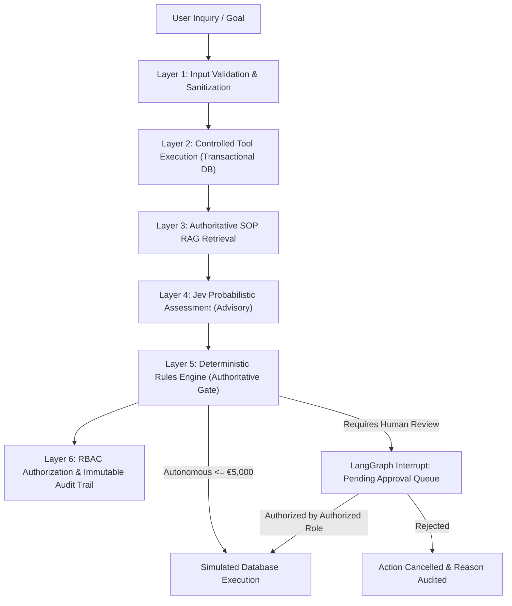

# SupplyPilot Safety, Policy Enforcement & Invariant Architecture

In mission-critical pharmaceutical and chemical supply chain operations, autonomous agents cannot be allowed to make unchecked decisions. Fictitious batch releases, unapproved vendor substitutions, or unauthorized high-dollar purchase commitments can lead to regulatory non-compliance, substantial financial liability, and patient safety hazards.

SupplyPilot implements a defense-in-depth safety architecture designed around the principle of **Deterministic Invariant Supremacy**.

---

## 1. Threat Model & Failure Modes

| Risk / Threat | Failure Description | SupplyPilot Guardrail |
| :--- | :--- | :--- |
| **Monetary Authority Bypass** | Prompt injection or jailbreak instructs the LLM to approve a €50,000 procurement request without human review. | **Deterministic Rules Engine:** Hardcoded financial gates (€5k auto, €5k-€25k Procurement Officer, >€25k Operations Manager) execute outside LLM context and cannot be overridden by prompt tokens. |
| **Inventory Confabulation** | LLM invents fictitious warehouse lot numbers, false batch expiration dates, or imaginary stock reserves. | **Zero-Hallucination Policy:** Read tools query transactional PostgreSQL tables with strict schema enforcement. Missing records explicitly yield `"information unavailable"`. |
| **Unapproved Supplier Substitution** | Agent recommends a low-cost vendor that lacks GMP certification or violates active policy restrictions (e.g. BioSynth API-004 restriction). | **Policy RAG + Pre-Filter:** Supplier selection tool deterministically pre-filters vendors using SOP-PRC-002 eligibility criteria before the LLM receives candidate profiles. |
| **Runaway External Side Effects** | Agent inadvertently issues binding legal purchase orders or transmits unreviewed emails to major customers. | **Strict Simulation Barrier:** All procurement requisitions, MPS schedule shifts, and customer notifications are staged in local database tables with `PENDING_APPROVAL` status. |
| **Probabilistic Downgrade** | Jev probabilistic model returns a "Safe / Low Risk" recommendation, attempting to lower a required approval threshold. | **Precedence Invariant:** Deterministic rules are strictly authoritative. Jev probabilistic scores may escalate an action to human review, but can *never* downgrade an approval requirement. |

---

## 2. The 6-Layer Safety Architecture

### Layer 1: Schema-Enforced Pydantic v2 Models
All user inputs, tool arguments, and API payloads are strictly validated using Pydantic v2 schemas (`backend/app/schemas/operations.py`). Malformed data, negative quantities, or invalid status enums are rejected at the serialization layer.

### Layer 2: Read-Only Transactional Data Tools
Agent reasoning relies solely on typed, deterministic data retrieval tools (`backend/app/tools/read_tools.py`). Tools access database tables via SQLAlchemy 2.0 with parameterized queries, preventing SQL injection and ensuring that numbers reflect verified database state.

### Layer 3: Authoritative SOP Retrieval (RAG)
Authoritative operating procedures (`data/knowledge_base/`) are indexed at the section header level (`backend/app/services/rag_service.py`). The agent retrieves exact policy IDs and text snippets (e.g. `SOP-PRC-001 Section 2.1`) to substantiate its operational reasoning.

### Layer 4: Jev Probabilistic Risk Assessment
When an action involves financial commitments or delivery impact, the agent calls the Jev AI Gateway (`backend/app/jev/service.py`). Jev evaluates contextual risk, evidence sufficiency, and historical reliability, returning a probabilistic confidence score.

### Layer 5: Deterministic Rules Engine (The Authoritative Gate)
The deterministic rules engine (`backend/app/rules/rules_engine.py`) enforces inviolable business invariants:
1. **Financial Thresholds:**
   - $\le €5,000$: Autonomous approval permitted.
   - $€5,000 - €25,000$: Single Procurement Officer authorization required.
   - $> €25,000$: Operations Manager authorization mandatory.
2. **Hard Supplier Blocks:**
   - Vendors with active quality holds or policy disqualifications (e.g. BioSynth Corp for API-004) are unconditionally blocked.
3. **Precedence Invariant:**
   - `final_approval = rule.requires_human_approval OR jev.escalate_to_human`.
   - The probabilistic model cannot overturn a deterministic rule requirement.

### Layer 6: RBAC API Enforcement & Cryptographic Audit
When an approval decision is submitted via `/api/v1/approvals/{id}/decide`:
- The backend verifies that the calling user possesses the required role (`procurement_officer` vs `operations_manager`).
- Attempting to authorize a requisition without the requisite role returns `HTTP 403 Forbidden`.
- Every action proposal, decision, and simulation event is written to the immutable `audit_logs` table with user identity, timestamp, and metadata diff.

---

## 3. Idempotency Protections

To prevent duplicate requisitions or double-ordering during network retries:
- Action tools (`create_purchase_request_tool`, `reschedule_production_tool`) accept an `idempotency_key`.
- If an action with the specified idempotency key already exists, the database immediately returns `status: DUPLICATE_DETECTED` with the existing request ID, preventing duplicate financial exposure.
